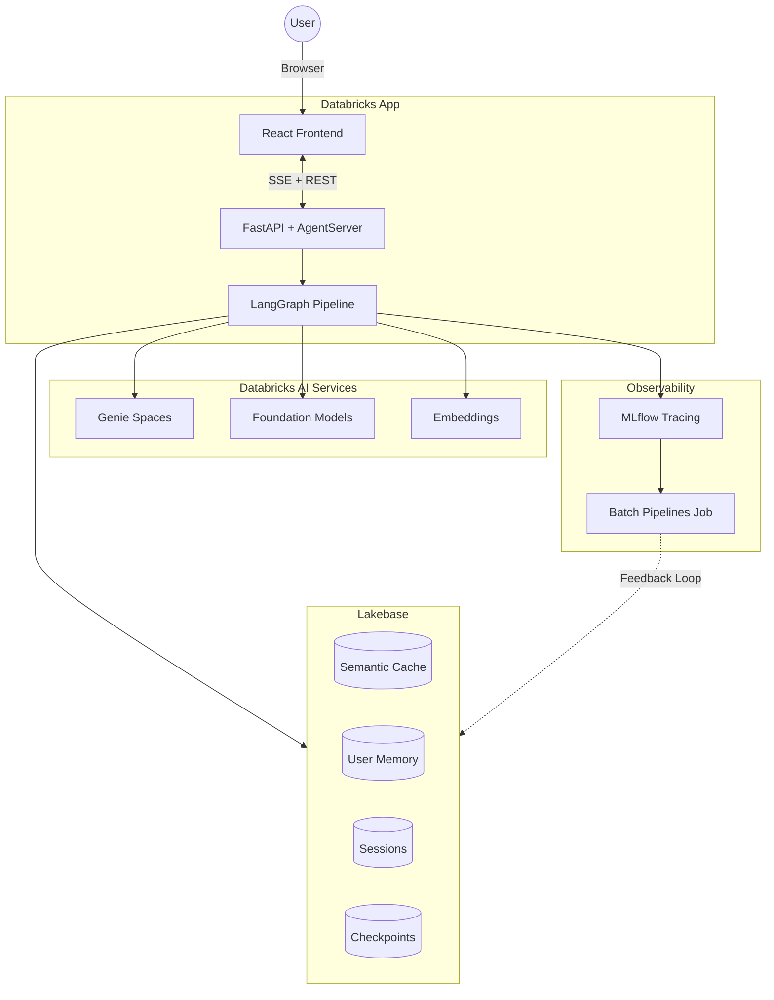
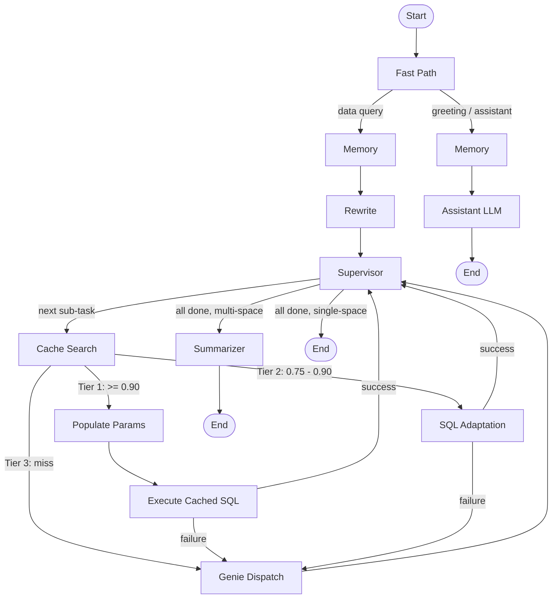

# Lakebase Genie Caching

A Databricks App that wraps **Genie Spaces** with semantic caching, user memory, and
supervisor-routed orchestration. Point it at one or more Genie Spaces and you get a
multi-space analytics agent whose cache learns from user feedback — repeat questions
skip Genie's natural-language-to-SQL step and return in a fraction of the time.

Built with **LangGraph**, **Lakebase** (PostgreSQL + pgvector), **MLflow Tracing**, and
**Foundation Model APIs** — deployed entirely via **Databricks Asset Bundles**.

Works with any Genie Space over any dataset. The only workspace-specific things you
change are your Space IDs, a SQL warehouse, and a Unity Catalog schema.

> **Measured on a live deployment** against two Genie Spaces (retail operations and
> sales pipeline): a fresh question took 36s through Genie; the same question
> reworded and served from cache took 7.9s at 95% similarity — a 4.5× speedup,
> identical rows. Side-by-side A/B on one question: 10.4s cached vs 28.6s uncached
> (64% faster).
>
> The cache stores **SQL, never results**. Every hit re-executes the cached query,
> so the speedup comes from skipping Genie's natural-language-to-SQL step rather
> than from replaying stored rows.

---

## Prerequisites

Before deploying, you need the following in your workspace. The bundle creates the
app, the MLflow experiment, both jobs, and the Lakebase project; everything else
must already exist.

| Requirement | Why | How to check |
|---|---|---|
| **Databricks CLI ≥ 0.298** and an authenticated profile | Everything below runs through it | `databricks auth profiles` |
| **A running SQL warehouse** | Genie queries and cached SQL execute here | `databricks warehouses list --profile <profile>` |
| **At least one Genie Space** you can read | The agent has nothing to route to otherwise | Space ID is the 32-hex segment of its URL: `/genie/rooms/<space_id>` |
| **A Unity Catalog catalog + schema** you can create tables in | Holds the archived MLflow traces the offline pipeline reads | You need `USE CATALOG` + `CREATE TABLE` |
| **Foundation Model endpoints** available in your region | `databricks-claude-sonnet-4`, `databricks-claude-haiku-4-5`, `databricks-gte-large-en` | `databricks serving-endpoints list --profile <profile>` |
| **Workspace admin rights** for first-time setup | `scripts/setup_workspace.py` grants the app's service principal access to Lakebase, the Genie Spaces, and their tables | — |

**Optional:** *user authorization on Apps* (Public Preview, admin-gated). With it,
Genie calls and cached SQL execute as the calling user so Unity Catalog enforces
per-user access; without it, both run as the app's service principal and everything
still works. Enable it — and set `REQUIRE_USER_AUTH=true` — before pointing the app
at data where users have differing access. See [Security model](#security-model).

Python 3.11 and Node 20 are needed only for local development and building the
frontend.

---

## Quick Start

**What you have to change:** your Genie Space IDs, a SQL warehouse ID, and a Unity
Catalog catalog + schema. That is the whole list. Nothing in this repo is wired to a
particular workspace, and the four workspace-specific variables have no defaults, so
a mistake fails at `validate` time rather than silently pointing at someone else's
warehouse.

**How long it takes:** ~50s to deploy, ~3 min for the app to start, a few seconds for
the permission script. Roughly five minutes end to end, most of it waiting.

Everything else — the Lakebase project, the MLflow experiment, both jobs, the app and
its permissions — is created for you by the bundle.

### 1. Set your variables

Create `.databricks/bundle/dev/variable-overrides.json` (gitignored):

```json
{
  "warehouse_id": "<your-warehouse-id>",
  "genie_space_ids": "<space-id-1>,<space-id-2>",
  "trace_archive_catalog": "<your-catalog>",
  "trace_archive_schema": "<your-schema>"
}
```

Or edit the `dev:` target in `databricks.yml`, or pass `--var warehouse_id=…` on
each command. The workspace itself comes from your CLI profile — targets
deliberately do not pin a `host`.

### 2. Deploy and start

```bash
databricks bundle validate -t dev --profile <your-profile>
databricks bundle deploy   -t dev --profile <your-profile>
databricks bundle run genie_cache -t dev --profile <your-profile>
```

`bundle run` starts the app compute *and* deploys the source code — first run
takes ~3 minutes. It prints the app URL when it finishes.

### 3. Grant the app's service principal access (once)

The app runs as its own service principal, which starts with no access to
Lakebase, your Genie Spaces, or their tables. This script grants all of it using
**your** credentials:

```bash
python scripts/setup_workspace.py --profile <your-profile> --target dev
```

Add `--dry-run` first to see exactly what it will do. If it reports
`Genie spaces: []`, your variables were not picked up — pass
`--genie-space-ids <id1,id2>` explicitly.

### 4. Restart so the app picks up the new grants

```bash
databricks bundle run genie_cache -t dev --profile <your-profile>
```

Then confirm it came up clean:

```bash
databricks apps logs lakebase-genie-caching --profile <your-profile>
```

You want to see `All stores initialized successfully` and
`startup complete. Active spaces: [...]` with your space titles. Any missing
configuration is reported as a `CONFIG:` line naming the exact variable.

> **Use `bundle run`, not `databricks apps start`.** `apps start` restarts the
> compute without re-applying the bundle's environment, so the app comes up
> missing `SQL_WAREHOUSE_ID` and `LAKEBASE_PROJECT` and runs in degraded mode.

---

## Security model

Read this before pointing the app at data where users have different access.

**The cache stores SQL, never results.** No result set and no assistant answer text
is persisted. Every cache hit re-executes the cached SQL, so what a caller sees is
produced by the warehouse at request time rather than replayed from storage. The
speedup comes from skipping Genie's natural-language-to-SQL step, which is the slow
part.

**The cache is shared across all users, by design.** A question one person asks
makes the same question faster for everyone. Cached SQL text is not treated as
sensitive.

**Queries prefer the caller's identity.** When user authorization is enabled, the
Databricks Apps proxy forwards each caller's OAuth token in
`x-forwarded-access-token`, and both Genie calls and cached SQL execute as that
user — so Unity Catalog decides which rows they see. When it is not enabled, both
fall back to the app's service principal so the app still works out of the box.
This needs the `sql` and `genie` scopes, declared in `databricks.yml` under
`user_api_scopes`.

**Set `REQUIRE_USER_AUTH=true` before pointing this at data where users have
differing access.** It refuses the service-principal fallback, so a request without
a caller token fails rather than running with the app's broader grants. Left off,
a cache hit returns rows fetched with the service principal's access — fine for
demo data, not for anything sensitive.

**What always runs as the service principal:** the offline batch pipelines (cache
promotion, memory extraction, eviction), MLflow trace writes, and startup
permission bootstrap.

**Personal memories are per-user.** Memory entries are scoped to a `user_id` and
the endpoints that read or delete them reject callers who are not that user.

**Endpoint authorization.** Endpoints scoped to a `user_id` reject callers who are
not that user (workspace admins may act for anyone, and this is logged).
Destructive and global operations — triggering batch jobs, eviction, deleting or
pinning cache entries, publishing FAQs, changing thresholds, resetting pipeline
state — require a workspace admin. Running locally (no `DATABRICKS_CLIENT_ID`)
relaxes these checks so the app is usable in development, and logs that it is
doing so.

**Before customer use, verify:** user authorization is enabled with the `sql` and
`genie` scopes; `REQUIRE_USER_AUTH=true` is set; two users with different UC grants
genuinely see different results; and the app's service principal has no broader
access than the audience it serves.

---

## Architecture



| Component | Role |
|-----------|------|
| **React Frontend** | Chat interface with streaming, cache/memory management, metrics |
| **FastAPI + AgentServer** | REST + SSE API, MLflow Responses API (`/invocations`), serves SPA |
| **LangGraph Pipeline** | Supervisor-loop orchestration: session, memory, cache, Genie, LLM nodes |
| **Lakebase** | PostgreSQL + pgvector for semantic cache, user memory, sessions, checkpoints |
| **Genie Spaces** | N configurable spaces for NL-to-SQL across different datasets |
| **Foundation Models** | Claude Sonnet 4 (assistant/supervisor) + Claude Haiku 4.5 (classifier) |
| **MLflow Tracing** | Per-invocation traces with spans, feedback capture, trace archive to Delta |
| **Batch Pipelines** | Scheduled job: cache promotion from thumbs-up feedback, memory extraction, eviction |

---

## How It Works

### Pipeline Flow

The pipeline uses a **supervisor loop**. A fast-path classifier (Haiku) routes greetings to the assistant and data queries through memory, rewrite, and the supervisor. The supervisor decomposes multi-part questions into sub-tasks and dispatches each through a three-tier cache check.



### Cache Tiers

| Tier | Similarity | Behavior |
|------|-----------|----------|
| **Tier 1 — Direct Hit** | >= 0.90 | Populate params, validate SQL (Haiku), execute on DBSQL |
| **Tier 2 — SQL Adaptation** | 0.75 - 0.90 | Extract new parameter values, substitute into cached SQL template, validate, execute. Requires a parameterized template — there is no text fallback |
| **Tier 3 — Miss** | < 0.75 | Fall through to Genie for fresh SQL generation |

**Both tiers validate the SQL before executing it.** Similarity alone is not enough.
"The 5 *worst* selling products" matches a cached "top 5 products by sales" template
at 0.77, and parameter extraction happily pulls `top_count=5` — but the cached
template sorts `DESC`, so substituting parameters returns the *best* sellers
labelled as the worst. Sort direction is not a parameter, so extraction cannot catch
it; a Haiku check does, and the question falls through to Genie. Verified live on
both a retail and a healthcare dataset.

**Nothing is replayed from storage.** The cache holds SQL and, where the entry was
parameterised, a template — never result sets and never the assistant's answer text.
Each hit re-executes, so results reflect the current data and the identity running
the query.

### Supervisor Loop

The supervisor sees all configured Genie Spaces and decomposes questions into
`[{space_id, task}]` pairs. Each sub-task goes through the cache pipeline scoped to
that Space. For multi-space results a summariser combines everything into a single
response.

Cache entries are keyed by `genie_space_id`, so each Space builds its own cache and a
question can only match an entry produced by the same Space. Entries are shared
across users — a question one person asks makes it faster for everyone.

---

## Configuration

All configuration lives in `databricks.yml`. Variables are the only thing you
change per workspace.

### Variables

| Variable | Required | Description | Default |
|----------|----------|-------------|---------|
| `warehouse_id` | **yes** | SQL warehouse for Genie queries and cached SQL | — |
| `genie_space_ids` | **yes** | Comma-separated Genie Space IDs (titles auto-resolved at startup) | — |
| `trace_archive_catalog` | **yes** | UC catalog for the trace archive table. Required by `bundle validate`; if left unset the online path still answers questions but the offline cache-promotion and memory pipelines are disabled | — |
| `trace_archive_schema` | **yes** | UC schema for the trace archive table | — |
| `lakebase_project` | no | Lakebase Autoscaling project (created by the bundle). **Must be changed if you re-deploy within 7 days of a `bundle destroy`** — see [Tearing down](#tearing-down-and-redeploying) | `lakebase-genie-caching` |
| `mlflow_experiment_name` | no | MLflow experiment path | `/lakebase-genie-caching` |
| `trace_archive_table` | no | UC table for archived MLflow traces | `mlflow_traces_archived` |
| `classifier_llm_endpoint` | no | Fast model for classification and validation | `databricks-claude-haiku-4-5` |
| `assistant_llm_endpoint` | no | Main model for summarisation, rewriting, and the assistant | `databricks-claude-sonnet-4` |

A missing required variable fails `bundle validate` by name, e.g.
`no value assigned to required variable trace_archive_schema`.

### Runtime tuning

Thresholds and timeouts are tunable without a redeploy via `PUT /api/tuning`
(admin-only, range-checked) or on the app's Config page. Environment overrides:
`REQUIRE_USER_AUTH`, `SESSION_MAX_AGE_DAYS`, `TIMEOUT_CLASSIFIER_LLM`,
`TIMEOUT_ASSISTANT_LLM`, `TIMEOUT_SUPERVISOR_LLM`, `TIMEOUT_CACHED_SQL`.

### Adding Genie Spaces

Add the ID to `genie_space_ids`, redeploy, then re-run `setup_workspace.py` so the
app's service principal is granted access to the new space and its tables. Titles
and descriptions are resolved from the Genie API at startup, and the supervisor
prompt picks up all configured spaces automatically.

### Targets

`dev` (default) and `prod` are templates. Neither pins a workspace host — that
comes from your CLI profile. `prod` runs the batch job on a schedule; `dev`
leaves it paused so you trigger it by hand.

---

## What gets created

`bundle deploy` creates:

- the Databricks App (`lakebase-genie-caching`) with its resource permissions
- the MLflow experiment
- the Lakebase Autoscaling project
- the **Trace Archive Job** (hourly) — archives MLflow traces into Delta
- the **Batch Pipelines Job** (`archive_fresh` → `batch_pipelines`)

`setup_workspace.py` then grants the app's service principal:

1. `CAN_USE` on the Lakebase project
2. A Lakebase OAuth role plus schema and table privileges
3. `CAN_MANAGE` on each configured Genie Space
4. `USE_CATALOG` + `USE_SCHEMA` + `SELECT` on the tables those Spaces reference

At startup the app creates its Lakebase tables, resolves Genie titles and sample
questions, and validates its configuration.

---

## Tearing down and redeploying

```bash
databricks bundle destroy -t dev --profile <your-profile>
```

This deletes the app, both jobs, the MLflow experiment, and **the Lakebase project
with all cached entries, memories, and sessions**.

> **If you redeploy within 7 days, change `lakebase_project` first.** Lakebase
> *soft*-deletes the project and holds its name for a 7-day retention window (the
> deleted project reports a `purge_time` a week out). A `bundle deploy` inside that
> window prints "Deployment complete!" but does **not** recreate the project, so the
> app starts with no database at all: no cache, no memory, no sessions. Every
> question still returns an answer via Genie, which is what makes this easy to miss.
>
> Set a new name and redeploy:
>
> ```json
> { "lakebase_project": "genie-cache-v2" }
> ```
>
> The app now logs `started in DEGRADED mode` with the cause when this happens, and
> `setup_workspace.py` exits non-zero rather than reporting success.

---

## Try It Out

These are **patterns, not literal questions** — substitute nouns from your own Genie
Spaces. The examples use a retail dataset; the shape is what matters.

### 1. Ask a question (cache miss)

> *What are the top 5 products by sales?*

Goes through Genie: it generates SQL, runs it, and summarises. Badge shows **miss**;
expect tens of seconds. Thumbs-up the answer.

### 2. Promote it into the cache

The cache fills from **positive feedback**, offline — a fresh deployment starts
empty, and nothing is cached until you thumbs-up an answer and run the batch job:

```bash
curl -X POST "$APP_URL/api/pipelines/cache" -H "Authorization: Bearer $TOKEN"
```

Or use the Pipelines button in the UI. See
[Offline / Online Pipeline](#offline--online-pipeline).

### 3. Ask again, phrased differently (cache hit)

> *Which 5 products have the highest sales?*

Badge shows **cache_hit** with the similarity score and a much lower latency. The
cached SQL is re-executed; Genie is not called.

### 4. Parameter substitution (Tier 2)

> *What are the top 8 products by sales?*

Same shape, different number. The cached SQL was stored as a template
(`LIMIT :top_count`), so the new value is extracted and substituted — returning 8
rows without calling Genie.

### 5. Semantic rejection

> *What are the 5 worst selling products?*

Close enough to match on similarity, but the opposite question. The cached template
sorts `DESC`; sort direction is not a parameter, so validation rejects the reuse and
routes to Genie for a correct query. This is the check that stops a cache from
returning confidently wrong answers.

### 6. Multi-space question

> *What are the top selling products, and how many open sales opportunities are there?*

With two or more Spaces configured, the supervisor decomposes this into one sub-task
per Space, routes each, and synthesises a single answer.

### 7. Memory

> *I'm a supply chain analyst and I mainly focus on perishables.*

Stated preferences and identity are extracted **offline** by the same batch job, then
folded into later answers. Ask *"do you remember what I care about?"* after the next
run.

Note that memories change the question before it reaches the cache — a stored "only
show the Portland region" preference makes an unfiltered cached query stop matching,
which is correct but does lower the hit rate.

### 8. A/B comparison

> *[A/B Compare] Which 5 products have the highest sales?*

Runs the same question with and without the cache in parallel, reporting the latency
delta and whether the results match.

---

## Offline / Online Pipeline

The online path answers questions and records MLflow traces. The offline path
turns positive feedback into reusable cache entries and memories.

1. Ask a fresh question — it shows `miss` and creates an MLflow trace.
2. Thumbs-up a good answer. The app writes `feedback_rating=1` to the trace in the background.
3. Trigger the batch job from the UI, or `POST /api/pipelines/cache` (admin-only).
4. `archive_fresh` runs the Trace Archive Job, writing fresh traces into
   `<trace_archive_catalog>.<trace_archive_schema>.<trace_archive_table>`.
5. `batch_pipelines` reads those traces, promotes thumbs-up misses into
   `cache_entries`, extracts user memories, and runs eviction (cache, memory, and
   expired sessions).
6. Ask a similar question again — it now hits the cache or adapts the
   parameterized SQL without calling Genie.

Confirm both tasks succeeded on the job run page, then check `/api/cache/entries`
and `/api/memory/entries/<user_id>`.

Memories are extracted **offline**, so a preference you state now influences
answers after the next batch run, not immediately.

---

## Development

### Local Setup

```bash
python -m venv .venv && source .venv/bin/activate
pip install -r requirements.txt
cp .env.example .env      # then fill in your workspace values
python scripts/start_app.py
# -> http://localhost:8000
```

Locally there is no proxy to forward a user token, so per-user query execution and
the endpoint authorization checks are relaxed (the app logs this). Do not treat a
local run as a test of the security model.

### Frontend (hot reload)

```bash
cd frontend && npm install && npm run dev
# -> http://localhost:5173 (proxies /api to :8000)
```

> **`frontend/dist` is committed on purpose.** `databricks.yml` excludes
> `frontend/src` from sync, so the deployed app serves the checked-in bundle.
> After any frontend change you must run `npm run build` in `frontend/` and commit
> the result, or the deployment silently serves stale UI.

### Tests

```bash
python -m pytest tests/ -v
```

Fully mocked — no workspace needed. The scripts that talk to a live deployment
(`tests/e2e_*.py`, `tests/benchmark.py`) read `GENIE_CACHE_APP_URL`,
`DATABRICKS_CONFIG_PROFILE`, and `GENIE_SPACE_IDS`; see `tests/env_config.py`.
`tests/test_no_hardcoded_identifiers.py` fails the build if a workspace-specific
identifier is reintroduced.

### Project Structure

```
lakebase-genie-caching/
├── agent_server/           # FastAPI entry point + MLflow AgentServer
├── backend/
│   ├── config.py           # All config (env vars) + startup validation
│   ├── services/
│   │   ├── graph.py        # LangGraph pipeline (nodes + wiring)
│   │   ├── pipeline/       # prompts, state, routing, space metadata
│   │   ├── auth_context.py # Caller identity + on-behalf-of clients
│   │   ├── authz.py        # require_self / require_admin
│   │   ├── background.py   # Fire-and-forget tasks that log failures
│   │   ├── cache_store.py  # Semantic cache (pgvector)
│   │   ├── memory_store.py # User memory (pgvector)
│   │   ├── genie_client.py # Genie Conversation API client
│   │   └── db.py           # Lakebase connection pool
│   ├── pipelines/          # Batch: cache promotion, memory extraction, eviction
│   └── routers/            # FastAPI routes: cache, feedback, memory, pipelines, spaces
├── frontend/src/           # React + TypeScript  (rebuild dist/ after changes)
├── jobs/                   # Databricks Job scripts
├── scripts/
│   ├── setup_workspace.py  # One-time post-deploy admin setup
│   └── start_app.py        # Local dev launcher
├── databricks.yml          # Single source of truth (variables, resources, targets)
├── app.yaml                # Runtime command only; env lives in databricks.yml
└── requirements.txt
```

---

## Troubleshooting

| Symptom | Cause and fix |
|---|---|
| `no value assigned to required variable …` | A required variable is unset. See [Variables](#variables). |
| `the host in the profile doesn't match the host configured in the bundle` | A target pins a `host`. Remove it and let `--profile` supply the workspace. |
| `CONFIG: SQL_WAREHOUSE_ID is not set` in the app logs, app in degraded mode | The app was started with `databricks apps start`, which does not re-apply the bundle environment. Use `databricks bundle run genie_cache -t <target>`. |
| `403 Invalid scope, required scopes: genie` | User authorization is enabled but `user_api_scopes` is missing `genie` (note: `dashboards.genie` is accepted by the Apps API but rejected by Genie itself). |
| `INSUFFICIENT_PERMISSIONS ... does not have USE CATALOG` | Working as intended: the query ran as **you**, and you lack Unity Catalog access to that Genie Space's tables. Grant yourself access, or use a Space over data you can read. |
| Cache never hits, everything shows **miss** | Expected on a fresh deployment — the cache fills from thumbs-up feedback via the batch job. See [Offline / Online Pipeline](#offline--online-pipeline). If entries exist and it still misses, check whether a stored memory is rewriting your question. |
| Batch job succeeds but promotes nothing | The watermark has already passed those traces. Ask a new question, thumbs-up it, and re-run. |
| `more than one authorization method configured: oauth and pat` | A `WorkspaceClient` was built with a token while the SP's OAuth env vars are present; pin `auth_type="pat"` as `auth_context` does. |
| `password authentication failed` for the SP against Lakebase | `setup_workspace.py` has not run, or ran before the app existed. Run it, then `bundle run` again. |
| `setup_workspace.py` reports `Genie spaces: []` | Variables were not resolved. Pass `--genie-space-ids <id1,id2>`. |
| Answers show **Genie (cache unavailable)** | Lakebase is unreachable. The app degrades to Genie rather than failing; check `/api/health` for `db_available`. |
| UI changes not visible after deploy | `frontend/dist` was not rebuilt. Run `npm run build` in `frontend/` and commit. |

---

## Tech Stack

| Layer | Technology |
|-------|-----------|
| Frontend | React 18, TypeScript, Vite |
| Backend | Python 3.11, FastAPI, Uvicorn |
| Pipeline | LangGraph (StateGraph, supervisor-loop) |
| Database | Lakebase (PostgreSQL 17 + pgvector) |
| Embeddings | `databricks-gte-large-en` (1024-dim) |
| LLMs | Claude Haiku 4.5 (classifier) + Claude Sonnet 4 (assistant) |
| NL-to-SQL | Databricks Genie Conversation API |
| Tracing | MLflow GenAI Tracing |
| Deployment | Databricks Asset Bundles |

---

## License

Apache 2.0 — see [LICENSE](LICENSE).
